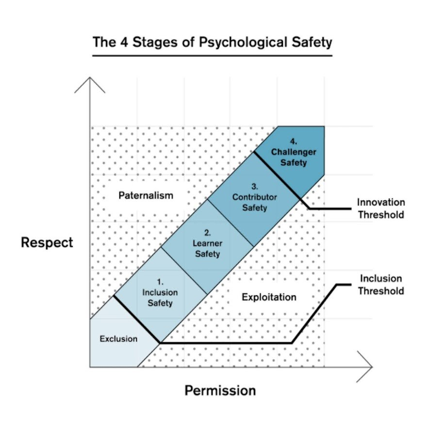

# Building High-Performing Teams Through Psychological Safety

Psychological safety refers to the belief that one can speak up, take risks, and make mistakes without fear of punishment or humiliation. This environment of trust and openness is essential for fostering innovation, collaboration, and overall team effectiveness.  There is a long history of studding [psychological safety](https://en.wikipedia.org/wiki/Psychological_safety) dating back to the early 1950’s with [Carol Rogers](https://en.wikipedia.org/wiki/Carl_Rogers) suggesting that it is a necessary component to foster an individual’s creativity.  More recently, in Timothy R Clark’s book [“The Four Stages Of Psychological Safety”](https://www.amazon.co.uk/gp/product/B07Y3ZJ8B2/ref=as_li_qf_asin_il_tl?ie=UTF8&tag=tomgeraghty-21&creative=6738&linkCode=as2&creativeASIN=B07Y3ZJ8B2&linkId=2b73447bf661c1641c8a6f41a0f4e761), he describes a conceptual model of four “stages” of psychological safety that teams can move through.  

### The Four Stages
Let’s dig into the concept of psychological safety, as described by Timothy R. Clark in his book.   These stages help teams understand and progress through different levels of psychological safety, ultimately fostering a more inclusive and high-performing environment.

- **Inclusion Safety:** This is the foundational stage where team members feel safe to belong to the team. They are comfortable being present, do not feel excluded, and feel like they are wanted and appreciated. Inclusion safety is about creating an environment where everyone feels accepted and valued for who they are.
- **Learner Safety:** In this stage, team members feel safe to learn through asking questions, giving, and receiving feedback, experimenting, and making mistakes. Learner safety encourages a culture of continuous improvement and growth, where team members can develop their skills and knowledge without fear of negative consequences.
- **Contributor Safety:** At this stage, team members feel safe to contribute their own ideas and suggestions without fear of embarrassment or ridicule. Contributor safety allows individuals to actively participate and share their unique perspectives, which can lead to innovative solutions and better decision-making.
- **Challenger Safety:** The final stage is where team members feel safe to challenge the status quo and question others' ideas, including those of authority figures. Challenger safety fosters an environment where constructive dissent is encouraged, and team members can suggest significant changes to ideas, plans, or ways of working without fear of retribution.

### The Importance of Psychological Safety
As [Edmondson and Lei](https://www.annualreviews.org/content/journals/10.1146/annurev-orgpsych-031413-091305) point out, psychological safety plays an important role in workplace effectiveness, it’s the cornerstone of a healthy and productive workplace. When team members feel safe to express their ideas and concerns, they are more likely to engage in open communication and share diverse perspectives. This leads to better problem-solving and decision-making, as the team can consider a wider range of solutions and approaches.  Moreover, I believe that psychological safety encourages creativity and innovation. Team members are more willing to take risks and experiment with new ideas when they know that their contributions will be valued and respected. This can lead to breakthrough innovations and improvements that drive the team's success.

### Building Psychological Safety
Creating a psychologically safe environment requires intentional effort from leaders and team members alike.  There are a lot of ideas or strategies on how to build and maintain psychological safety within a team, I’ve picked a few that I think are foundational.    

- **Encourage Open Communication:**  Foster an environment where team members feel comfortable sharing their thoughts and ideas. Encourage active listening and show appreciation for diverse viewpoint.  
- **Model Vulnerability:** Leaders should model vulnerability by admitting their own mistakes and uncertainties. This sets the tone for the team and demonstrates that it is okay to be imperfect.
- **Promote Inclusivity:** Ensure that all team members have an equal opportunity to contribute. Create a culture of respect and inclusivity where everyone's voice is heard and valued.
- **Provide Constructive Feedback:**  Offer feedback in a constructive and supportive manner. Focus on the      behavior or outcome rather than the individual and provide specific suggestions for improvement.
- **Celebrate Mistakes as Learning Opportunities:** Encourage a growth mindset by viewing mistakes as opportunities for learning and development.  Celebrate the lessons learned from failures and use them to improve future performance.

### The Impact of Psychological Safety on Team Performance
A team with a high degree of psychological safety experiences numerous positive impacts that contribute to its overall performance and well-being. Here are some key benefits, I see from teams that have a high degree of psychological safety. 

- **Enhanced Innovation and Creativity:** When team members feel safe to express their ideas and take risks without fear of negative consequences, they are more likely to engage in creative problem-solving and innovative thinking. This leads to the development of new and effective solutions.
- **Improved Collaboration and Communication:** Psychological safety fosters an environment where open communication and collaboration are encouraged. Team members feel comfortable sharing their thoughts, asking questions, and providing feedback, which enhances teamwork and strengthens relationships.
- **Increased Engagement and Motivation:** When individuals feel valued and respected, they are more likely to be engaged and motivated in their work. Psychological safety creates a sense of belonging and purpose, leading to higher levels of commitment and productivity.
- **Greater Innovation:** When team members feel safe to take risks and experiment, they are more likely to come up with creative solutions and innovative ideas. This drives continuous improvement and keeps the team competitive.
- **Better Decision-Making:** Teams with high psychological safety benefit from diverse perspectives and ideas, which contribute to more informed and effective decision-making. The ability to openly discuss and challenge ideas leads to better outcomes.
- **Reduced Stress and Burnout:** A psychologically safe environment helps reduce stress and anxiety among team members. When individuals feel supported and understood, they are less likely to experience burnout and more likely to maintain a healthy work-life balance.
- **Enhanced Learning and Development:** Teams with high psychological safety are more open to learning from mistakes and seeking feedback. This continuous learning culture promotes personal and professional growth, leading to improved skills and competencies

Psychological safety is a vital component of high-performing teams.  Fostering an environment of trust, openness, and respect, we can unlock the full potential of our team. Investing in psychological safety is a strategic advantage that can propel teams to new heights of performance and innovation.   *All it takes is a little courage by each of us to get started.* 
