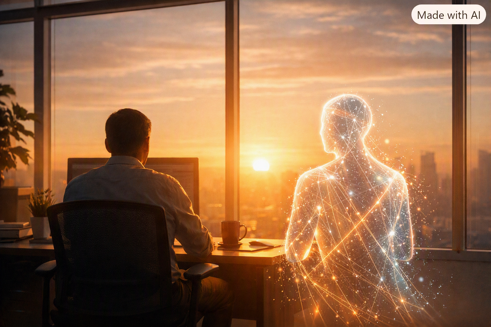

# Human–Agent Workforce: A Caring, Human-Centered Two-Part Blog
AI isn't just transforming workflows - it's reshaping the very fabric of how people experience work. As digital agents take on routine tasks, humans inherit complexity, emotion, and judgment. This first part explores why traditional workforce models are breaking, how early‑career development must evolve, and what leaders need to understand to support a blended human–agent workforce with empathy and intention.

## PART I: The Organizational Shift No One Is Planning For
Somewhere in your organization today, work was performed by a non‑human worker.
An AI agent drafted content, triaged a ticket, summarized a meeting, or made a routing decision that shaped a customer's experience. These systems are no longer "tools." They are becoming digital teammates - showing up in our workflows with responsibilities, identities, and measurable output.
Mercer calls this the rise of the human–agent hybrid workforce, where AI workers operate alongside people as part of the everyday operating model. McKinsey argues that organizations are evolving into agentic operating models - interconnected networks of autonomous digital workers orchestrated by humans.
This shift is not just technological. It is organizational, cultural, and deeply human. And most leaders are not yet planning for it.

## Why Our Current Models Break
For decades, workforce planning has been built around a simple assumption: humans are the unit of labor.
AI breaks that assumption.
Mercer points out that AI agents carry real, variable costs: compute, licensing, retraining, and monitoring. CX Today highlights that Microsoft's AI Credit Estimation tools now treat AI agents like headcount - something you must forecast, budget, and govern.
David Wilkins adds another layer: supervision costs. Every AI agent requires human oversight to review outputs, correct hallucinations, and perform rework. This oversight isn't optional - it's part of the job now.
This means your demand plan needs three parallel lines of capacity:
- Human capacity - skills, hours, cost
- AI agent capacity - throughput, direct cost
- Oversight capacity - human time required to govern agents

This is the new "mix equation", that blends human and non‑human labor to deliver the outcome at acceptable cost and risk?
McKinsey's research shows that this mix is dynamic. As agents improve, the cost curve shifts. As regulation tightens, oversight burdens grow. As workflows evolve, the human–agent balance must be recalibrated.
Most organizations are not ready for this level of fluidity - and that's okay. It simply means leaders need to start planning differently.

### The Disappearing "Easy Work"
AI doesn't replace jobs cleanly. It hollows them out at the task level.
AI excels at high‑volume repetition, drafting, summarization, and data triage. Humans inherit ambiguity, emotionally charged escalations, exceptions, and judgment calls.
CX Today describes this as the "mess nobody planned for," where shared queues between humans and AI break traditional workforce planning assumptions because the remaining human work becomes heavier, sharper, and more emotionally loaded. Because the simple, introductory work is handled by digital layers, the remaining human work becomes oddly lopsided and dense.

### And here's the deeper reason: agentic AI learns over time.
Unlike procedural software or RPA, which follow fixed rules and produce predictable outputs, agentic AI adapts based on context, feedback, and prior interactions. This means:
- The tasks AI handles today may expand or shift tomorrow.
- The edge cases humans inherit change as the agent learns.
- The handoff between agent and human is not static - it evolves.

This learning behavior is powerful, but it also means the "easy work" doesn't just disappear - it disappears differently every month, leaving humans to absorb whatever complexity remains.
This is why people feel the change so personally. Their work isn't just different - it's heavier.

## Early‑Career Development in a New Marketplace
Early‑career development isn't collapsing - it's changing shape. The marketplace no longer rewards slow, linear skill progression. New employees aren't easing into their roles through simple tasks anymore. Those tasks are disappearing. Instead, they're stepping directly into complexity. Organizations must rebuild the early‑career ladder with intention and care.

**Structured Simulation Labs** give new hires simulated "edge cases" so they can practice judgment without real‑world risk. This changes the way employers onboard, supporting new employees with human - agent pairing.

**Rotational Task Portfolios:** Instead of starting with simple tasks (now automated), rotate new hires through curated sets of complex tasks with coaching.

**Apprenticeship‑Style Shadowing:** Let new hires shadow senior staff during escalations to build intuition that used to come from low‑stakes work.

**Micro‑learning for Decision‑Making:** Short, targeted modules that teach pattern recognition, emotional intelligence, and exception handling.
Early‑career development becomes more intentional, curated, and judgment‑heavy, and leaders must support employees through that transition with patience and empathy.

## Leadership in the Age of Digital Teammates
Leadership models assume managers supervise humans. AI breaks that assumption. Harvard Business Review's Designing a Successful Agentic AI System argues that organizations must appoint human mission owners, leaders responsible for orchestrating both human employees and digital agents to hit KPIs.
But this shift introduces new leadership challenges, and each has a deeper "why" that matters in a human–agent workforce.

### Managing Invisible Work
Oversight, correction, and monitoring of AI agents is real work that's not always visible in dashboards.
Why it matters: If leaders don't recognize oversight as legitimate labor, they unintentionally create burnout and resentment. People end up doing "shadow work" that isn't measured, rewarded, or staffed for. This hides the true cost of automation and makes employees feel unseen.

### Understanding Digital Behavior
AI agents have drift patterns, failure modes, and escalation triggers that leaders must learn to interpret these signals, similarly to how they interpret these signals in their human counterparts.
Why it matters: Agentic AI makes this harder. Agentic AI is not procedural. It doesn't follow a fixed script or deterministic workflow. It learns, adapts, and changes its behavior based on new data, user interactions, and environmental context.
Leaders must understand:
- why an agent's behavior changed
- what triggered the drift
- how the agent is interpreting its environment
- when human intervention is required

Without this understanding, leaders end up reacting to AI issues instead of guiding them, and humans absorb the fallout.

### Continuous Workflow Redesign
Agentic organizations are fluid. Leaders must be comfortable redesigning workflows regularly, not annually.
**Why it matters:** AI capabilities change faster than traditional org charts. A workflow that works today may be inefficient or risky in a few weeks. Treating workflows as living systems keeps human–agent handoffs clean and prevents outdated processes from overwhelming people.

## Protecting Human Identity and Status
When digital teammates take over routine tasks, leaders must actively preserve human meaning, recognition, and belonging.
**Why it matters:** People derive identity from the work they do. When automation absorbs tasks that once signaled expertise, employees can feel devalued or sidelined. That identity shock hits engagement, retention, and confidence. Leaders need to spotlight human judgment, empathy, creativity, and relationship‑building as core value.

### Owning AI Risk
Bain & Company's research is clear that every digital worker needs a job description, identity credentials, permissions, and escalation paths.
**Why it matters:** AI introduces new operational, ethical, and compliance risks. If no one clearly owns those risks, they fragment across IT, operations, and compliance, creating blind spots. Leaders must govern AI agents with the same rigor as human employees to ensure accountability and safety.

## The Leadership Shift
This is not "more leadership." It is different leadership - orchestration instead of supervision. Leaders must learn to manage a blended workforce where humans and digital teammates collaborate, escalate, and co‑produce outcomes. The organizations that master this shift will outperform those that treat AI as just another tool - and their people will feel supported rather than overwhelmed.

## References 
- McKinsey - The Agentic Organization: https://www.mckinsey.com/capabilities/people-and-organizational-performance/our-insights/the-agentic-organization-contours-of-the-next-paradigm-for-the-ai-era

- Mercer - Human–Agent Hybrid Workforce: https://www.mercer.com/en-us/insights/total-rewards/total-rewards-strategy/unlocking-the-potential-of-the-human-agent-hybrid-workforce/

- CX Today - Human–AI Workforce Management: https://www.cxtoday.com/ai-automation-in-cx/human-ai-workforce-management/

- David Wilkins - Non‑Human Workers: https://www.linkedin.com/pulse/your-workforce-already-includes-non-human-workers-none-david-wilkins-46jjc/

- Harvard Business Review - Agentic AI Systems: https://hbr.org/2025/10/designing-a-successful-agentic-ai-system

- Bain & Company - AI Governance: https://www.bain.com/insights/agentic-ai-governance-risk-and-controls-for-business-leaders/

