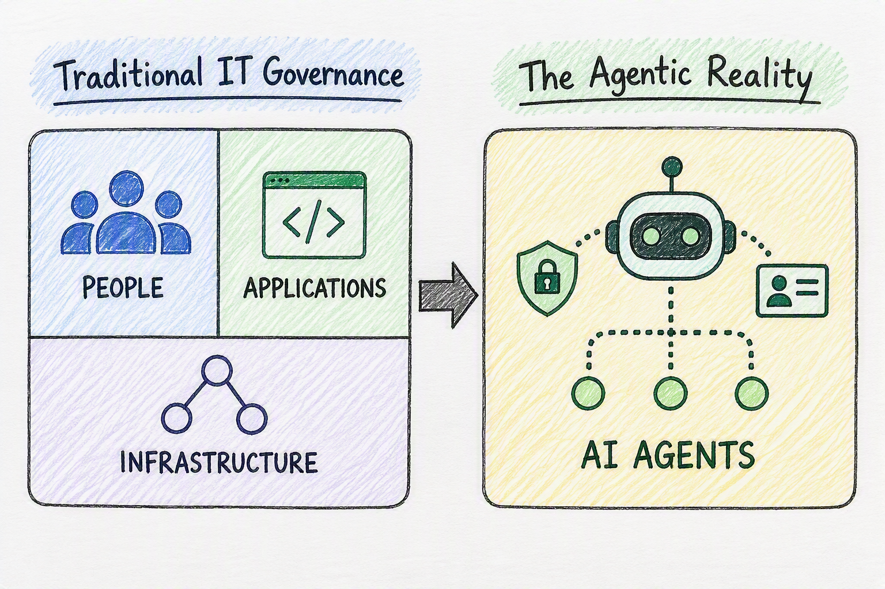
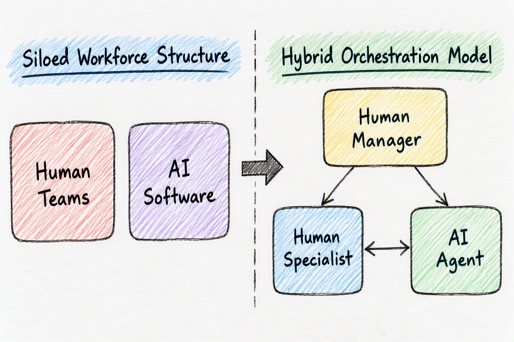
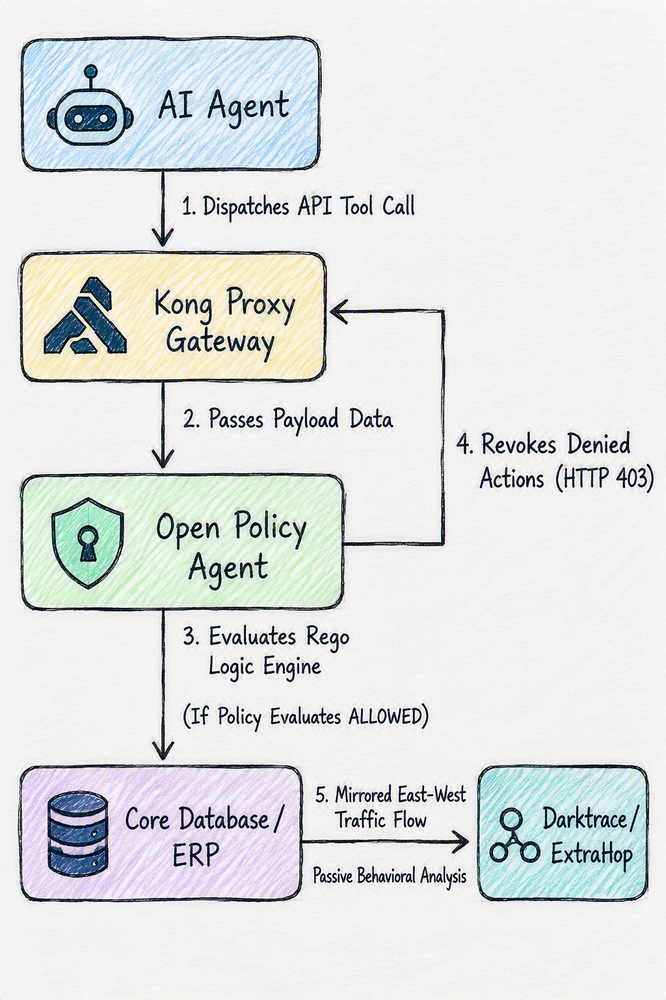

# Governance for the New Enterprise AI Actor

Beyond the immediate technology implications of this AI wave, I find myself thinking about how AI agents impact organizational structures, workforce planning, governance, security, and the overall human experience at work. One of the ideas I've been exploring recently is that AI agents are beginning to move beyond being simple tools. They are increasingly becoming digital teammates that participate in workflows, make decisions, perform work, and influence outcomes. 

Historically, enterprise architecture and corporate security models have operated on a clean, structure with focuse on governing people, applications, and infrastructure. People possessed identities; applications consisted of static, predictable code; infrastructure formed the network boundaries connecting them. 



AI agents seem to sit somewhere in between all three, which is why I think the architecture, governance, and security implications are much bigger than the technology itself. When an autonomous entity triggers an API or updates a database record based on its own internal prompting, it exercises a level of programmatic agency that bypasses traditional access boundaries.

As we push to shift left and drive deeper automation into the enterprise, we encounter a similar set of hurdles to what we've seen with past process and automation improvements [DevSecRegOps: What Does It All Mean?](https://medium.com/@kotzo1/devsecregops-what-does-it-all-mean-5a70704e53cf). Running these systems through shared human employee accounts breaks corporate audit trails, over-extends operational privileges, and blurs legal accountability. If we continue treating them as simple applications, we introduce severe identity gaps. Instead, we must begin treating them as a completely new class of non-human enterprise identity that requires its own distinct governance and operating model [NIST Cybersecurity Insights](https://www.nist.gov/blogs/cybersecurity-insights/back-future-why-agentic-ai-needs-strong-identity-foundation).

### Deterministic Guardrails Around Probabilistic Systems

Gartner approaches this shift and recommends treating AI agents as untrusted non-human identities operating within deterministic guardrails [Gartner on Agent Governance](https://www.gartner.com/en/newsroom/press-releases/2026-05-26-gartner-says-applying-uniform-governance-across-ai-agents-will-lead-to-enterprise-ai-agent-failure). While our terminology is different, I think both perspectives are describing the same organizational shift: AI agents are becoming a new category of actor within the enterprise. 

What stood out to me in the Gartner analysis is the idea of placing deterministic guardrails around probabilistic systems. AI agents can reason, adapt, and determine their own execution paths, which is fundamentally different from traditional software. That raises, what I think, is an interesting question: should we think of these systems as applications, or as a new class of enterprise identity that requires its own governance and operating model?

With a [considerable number of security incidents tied to mistakes in human decision-making](https://www.infosecurity-magazine.com/news/data-breaches-human-error/), introducing autonomous agents creates a new category of operational and security risk. Will every agent error become a security incident? Probably not. But some will. The challenge is less about eliminating mistakes and more about ensuring we have the right controls, oversight, and containment mechanisms when they occur. [BCG](https://www.bcg.com/publications/2026/managing-data-risk-in-the-age-of-agentic-ai).

To manage this risk surface effectively, we must move away from flat, uniform security blankets. A uniform control plane inevitably triggers two destructive outcomes: it either over-restricts simple agents and stalls organizational velocity, or it under-restricts advanced, high-autonomy agents and exposes critical data assets. Resilience requires a model of proportional governance that scales controls directly to the agent's active execution boundaries:

| Autonomy Level | Agent Role | Execution Boundary | Core Governance Mechanism |
| :--- | :--- | :--- | :--- |
| **Observe** | Environmental monitoring | Read-only access | Standard IAM read permissions |
| **Advise** | Contextual recommendations | Read-only + Human prompt | Output verification filtering |
| **Approve** | Workflow execution | Human-in-the-loop gate | Cryptographic human authorization |
| **Autonomously Act** | Full self-execution | Deterministic guardrails | Real-time network interception & kill-switches |

### Defusing the Lifecycle and Ownership Vacuum

As these systems evolve and multiply, they create a silent operational liability that I think of as an ownership vacuum. Unlike a legacy software application that sits completely inert until a user explicitly clicks a button, an autonomous agent continues running its loops, querying data, and executing API mutations completely unmanaged. If the original engineer or business user who deployed that agent leaves the organization, the agent continues to act with its assigned permissions, creating "orphaned agency."

To address this vacuum, we must establish a clear Agent Lifecycle Management framework. Every non-human agent identity must be mapped directly to an active human sponsor or an accountable business unit. If that human sponsor is deactivated within the enterprise directory, the associated agent's authorization chain must instantly trigger a protective pause. 

Furthermore, cloud security research indicates that agentic systems are highly vulnerable to contextual privilege creep; an agent authorized to read a corporate calendar can autonomously decide to broadcast malicious event descriptions based on its interpretation of the surrounding data [The Non-Human Identity Governance Vacuum](https://labs.cloudsecurityalliance.org/research/csa-whitepaper-nonhuman-identity-agentic-ai-governance-v1-cs/) . This means that lifecycles must include hard-coded, automated re-attestation gates to prune access scopes and enforce active, cryptographic kill switches.

### Workforce Planning: From Agent to Co-Workers

This shift also forces us to rethink workforce planning and organizational design. We cannot view agents merely as tools to reduce headcount or treat them like ephemeral infrastructure components. In past architectural shifts, we moved from custom-built servers to highly automated, containerized deployments—the classic ["cattle vs. pets vs. chickens vs. insects"](https://medium.com/@kotzo1/the-farm-and-modern-infrastructure-777c5bebb092) philosophy. But while application / systems / microservices are designed to be entirely immutable, disposable, and programmatic, AI agents function as adaptive, [reasoning digital teammates](https://medium.com/@kotzo1/exploring-how-humans-and-ai-work-side-by-side-cf98ebe8bb4a). 

Workforce planning must transition from human substitution to human-agent orchestration. Human leaders will spend less time tracking daily task execution and more time serving as prompt and context architects, defining behavioral boundaries for their agent cohorts and auditing operational data logs. 



Concurrently, human specialists will pivot toward critical evaluation and exception handling, stepping in only when deterministic controls flag a deviation. This model creates a demand for completely new capability domains within the enterprise: AgentOps engineers to manage version control, [Non-Human Identity](https://www.nccgroup.com/governing-non-human-identities-how-to-secure-the-new-digital-workforce/) officers to oversee credential lifecycles, and Cognitive QA testers to deliberately stress-test probabilistic systems against hallucination and privilege escalation loops before they reach production networks.

### The Runtime Control Plane: Enforcing API Mediation

To me, this is where traditional "if-then-else" controls, signatures, and static rule engines start to show their limitations. Those approaches work well when systems behave predictably. Agentic systems, by design, do not. As these systems evolve, so do the potential error, attack, and operational risk surfaces. 

I think Gartner is directionally correct in recommending network-level governance and deterministic controls around these systems. Leveraging [Kong's gateway](https://www.extrahop.com/blog/when-ai-agents-go-rogue-the-network-is-your-last-line-of-defense) and [OPA/Rego](https://www.openpolicyagent.org/), to provide Policy-as-Code as part of that control plane. Reverse proxy, API mediation, protocol translation, and policy enforcement capabilities give us a practical mechanism to intercept and govern agent behavior before actions are executed.


#### Runtime Execution Interception Flow



```text
   +-----------------------+

   |  AI Agent (NHI Token) |
   +-----------------------+
               |
               | 1. Dispatches API Tool Call
               v
   +-----------------------+

   |   Kong Proxy Gateway  | <---+
   +-----------------------+     |

               |                 |
               | 2. Passes Payload Data
               v                 |
   +-----------------------+     | 4. Revokes Denied Actions (HTTP 403)

   |   Open Policy Agent   |     |
   +-----------------------+     |

               |                 |
               | 3. Evaluates Rego Logic Engine
               +-----------------+
               |
               | (If Policy Evaluates ALLOWED)
               v
   +-----------------------+

   | Core Database / ERP   | ───> 5. Mirrored East-West Traffic Flow
   +-----------------------+      (Passive Behavioral Out-of-Band Analysis)
                                        |
                                        v
                              +-----------------------+

                              | Darktrace / ExtraHop  |
                              +-----------------------+
```

### Detecting the Unpredictable: The Role of NDR

That said, I suspect governance and prevention controls alone won't be enough. We'll also need capabilities that can identify emergent behavior and patterns we did not anticipate when the policies were written. 

This is where I see value in Network Detection and Response (NDR) platforms such as [ExtraHop's AI defence framework](https://www.extrahop.com/blog/when-ai-agents-go-rogue-the-network-is-your-last-line-of-defense) or [Darktrace's self learning AI](https://www.darktrace.com/blog/how-ai-is-transforming-cybersecurity-practices). Not as a replacement for gateways, Intrusion Detection systems (IDS), Endpoint Detection Response (EDR), or traditional monitoring, but as a complementary layer that helps identify anomalous agent behavior, unexpected communication paths, privilege misuse, lateral movement, or entirely new patterns that deterministic controls may miss.

Ultimately, we are not just discussing a new technology; we are discussing a new actor in the ecosystem. Managing this agentic shift successfully requires us to prioritize comprehensive, network-level architecture over simple tooling. By treating agents as distinct non-human identities, instituting proactive API mediation, and deploying out-of-band behavioral tracking, we can scale this digital workforce safely and resiliently.


