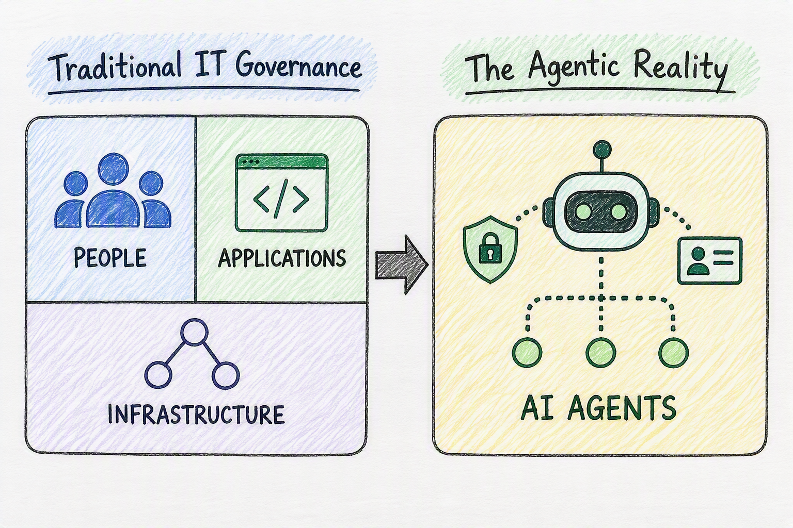
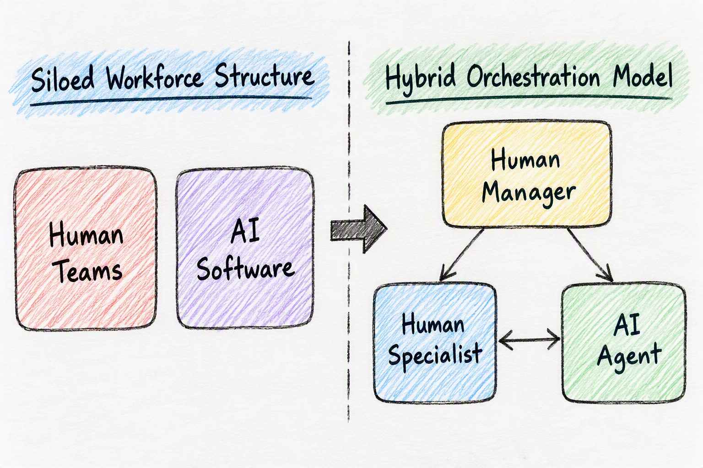
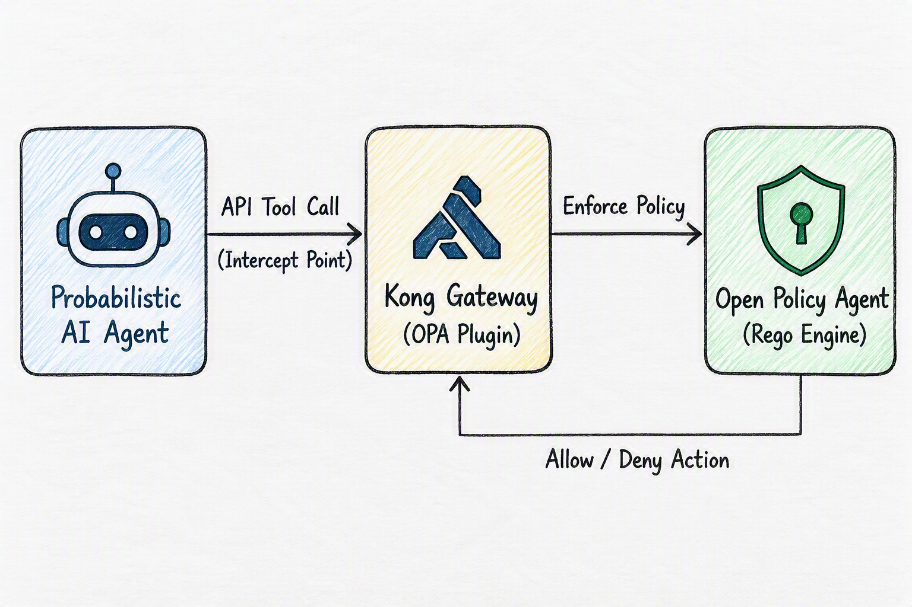
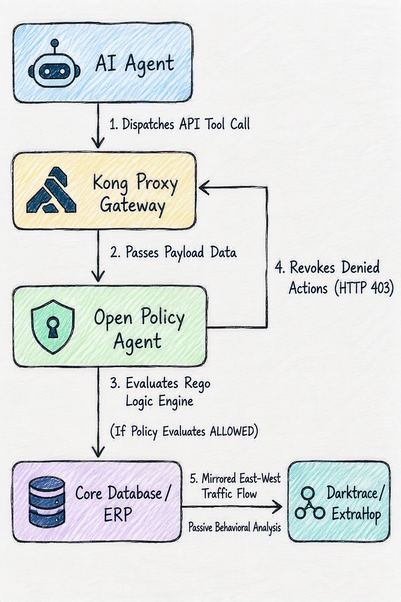

# Governance for the New Enterprise AI Actor

Beyond the immediate technology implications of this AI wave, AI agents sit between people, applications, and infrastructure, and existing governance models weren't built for that.  One of the ideas I've been exploring recently is that AI agents are beginning to move beyond being simple tools. They are increasingly becoming digital teammates that participate in workflows, make decisions, perform work, and influence outcomes. 

Historically, enterprise architecture and corporate security models have operated on a clean structure with focus on governing people, applications, and infrastructure. People possessed identities; applications consisted of static, predictable code; infrastructure formed the network boundaries connecting them. 

AI agents seem to sit somewhere in between all three, which is why I think the architecture, governance, and security implications are much bigger than the technology itself. When an autonomous entity triggers an API or updates a database record based on its own internal prompting, it exercises a level of programmatic agency that bypasses traditional access boundaries.



As we push to shift left and drive deeper automation into the enterprise, we encounter a similar set of hurdles to what we've seen with past process and automation improvements. [ [DevSecRegOps: What Does It All Mean?](https://medium.com/@kotzo1/devsecregops-what-does-it-all-mean-5a70704e53cf) ] Running these systems through shared human employee accounts breaks corporate audit trails, over-extends operational privileges, and blurs legal accountability. If we continue treating them as simple applications, we introduce severe identity gaps. Instead, we must begin treating them as a completely new class of non-human enterprise identity that requires its own distinct governance and operating model, a position [NIST has also begun to formalize.](https://www.nist.gov/blogs/cybersecurity-insights/back-future-why-agentic-ai-needs-strong-identity-foundation)

### Deterministic Guardrails Around Probabilistic Systems

Gartner approaches this shift and recommends treating AI agents as untrusted non-human identities operating within deterministic guardrails. [ [Gartner on Agent Governance](https://www.gartner.com/en/newsroom/press-releases/2026-05-26-gartner-says-applying-uniform-governance-across-ai-agents-will-lead-to-enterprise-ai-agent-failure) ]  While our terminology is different, I think both perspectives are describing the same organizational shift: AI agents are becoming a new category of actor within the enterprise. 

What stood out to me in the Gartner analysis is the idea of placing deterministic guardrails around probabilistic systems. AI agents can reason, adapt, and determine their own execution paths, which is fundamentally different from traditional software. That raises, what I think, is an interesting question: should we think of these systems as applications, or as a new class of enterprise identity that requires its own governance and operating model?

With a [considerable number of security incidents tied to mistakes in human decision-making](https://www.infosecurity-magazine.com/news/data-breaches-human-error/), introducing autonomous agents creates a new category of operational and security risk. Will every agent error become a security incident? Probably not. But some will. The challenge is less about eliminating mistakes and more about ensuring we have the right controls, oversight, and containment mechanisms when they occur. 

To manage this risk surface effectively, we must move away from flat, uniform security blankets. A uniform control plane inevitably triggers two destructive outcomes: it either over-restricts simple agents and stalls organizational velocity, or it under-restricts advanced, high-autonomy agents and exposes critical data assets. Resilience requires a model of proportional governance that scales controls directly to the agent's active execution boundaries:

| Autonomy Level | Agent Role | Execution Boundary | Core Governance Mechanism |
| :--- | :--- | :--- | :--- |
| **Observe** | Environmental monitoring | Read-only access | Standard IAM read permissions |
| **Advise** | Contextual recommendations | Read-only + Human prompt | Output verification filtering |
| **Approve** | Workflow execution | Human-in-the-loop gate | Cryptographic human authorization |
| **Autonomously Act** | Full self-execution | Deterministic guardrails | Real-time network interception & kill-switches |

 [ [Gartner on Agent Governance](https://www.gartner.com/en/newsroom/press-releases/2026-05-26-gartner-says-applying-uniform-governance-across-ai-agents-will-lead-to-enterprise-ai-agent-failure) ] 

Tiered controls solve the question of how much governance each agent requires. They do not, on their own, solve the question of who remains responsible for maintaining those controls over time, and that gap creates a risk of its own.

### Lifecycle and Ownership Vacuum

As these systems evolve and multiply, they create a silent operational liability that I think of as an ownership vacuum. Unlike a legacy software application that sits completely inert until a user explicitly clicks a button, an autonomous agent continues running its loops, querying data, and executing API mutations completely unmanaged. If the original engineer or business user who deployed that agent leaves the organization, the agent continues to act with its assigned permissions, creating "orphaned agency."

To address this vacuum, we must establish a clear Agent Lifecycle Management framework. Every non-human agent identity must be mapped directly to an active human sponsor or an accountable business unit. If that human sponsor is deactivated within the enterprise directory, the associated agent's authorization chain must instantly trigger a protective pause. 

Furthermore, cloud security research indicates that agentic systems are highly vulnerable to contextual privilege creep; an agent authorized to read a corporate calendar can autonomously decide to broadcast malicious event descriptions based on its interpretation of the surrounding data. This means that lifecycles must include hard-coded, automated re-attestation gates to prune access scopes and enforce active, cryptographic kill switches.  [ [The Non-Human Identity Governance Vacuum](https://labs.cloudsecurityalliance.org/research/csa-whitepaper-nonhuman-identity-agentic-ai-governance-v1-cs/) ]

### The Era of Hybrid Workforce Orchestration
Establishing these lifecycle controls and governance frameworks is only feasible if the right human roles exist inside the organization to design, enforce, and audit them. That is what makes workforce planning inseparable from agent governance.  Workforce planning must transition from tracking simple human headcount to orchestrating complex human-agent workflows. As autonomous AI systems move from simple software tools to digital coworkers operating directly alongside employees, organizations face an immediate demand for entirely new structural roles within the modern enterprise layout—specifically: AgentOps Engineers, Non-Human Identity Officers, and Cognitive QA Testers. [ [AI agents are joining your workforce](https://thenextweb.com/news/ai-agents-workforce-not-ready-guy-couillard) ]

Workforce planning must transition from human substitution to human-agent orchestration. Human leaders will spend less time tracking daily task execution and more time serving as prompt and context architects, defining behavioral boundaries for their agent cohorts and auditing operational data logs. 



Concurrently, human specialists will pivot toward critical evaluation and exception handling, stepping in only when deterministic controls flag a deviation. This model creates a demand for completely new capability domains within the enterprise: AgentOps engineers to manage version control, [Non-Human Identity](https://www.nccgroup.com/governing-non-human-identities-how-to-secure-the-new-digital-workforce/) officers to oversee credential lifecycles, and Cognitive QA testers to deliberately stress-test probabilistic systems against hallucination and privilege escalation loops before they reach production networks.

As highlighted by foundational industry research from global groups like The [Adecco Group](https://www.adeccogroup.com/our-thinking/flagship-research/rise-of-hybrid-labor-markets) on the emergence of hybrid labor markets, this shift does not eliminate the need for human talent. Rather, it drastically elevates the baseline skills required to navigate the enterprise. As low-complexity, deterministic tasks are permanently offloaded to agent loops, the human workforce transitions from basic execution into an orchestra of governors, strategists, and safety net operators.  Enterprise design must formally establish three foundational, cross-disciplinary pillars within the technical org chart:

- AgentOps Engineers (The Digital Fleet Managers): Just as DevOps revolutionized software deployment, AgentOps engineers manage the active lifecycle of the autonomous fleet. They do not build the underlying LLMs. Instead, they write the orchestration layers, configure systemic memory across sessions, manage token efficiency, and closely monitor agent system telemetry to detect when an agent is caught in an infinite processing loop or suffering from cognitive drift. [ [What is AgentOps?](https://www.ibm.com/think/topics/agentops) ]
- Non-Human Identity Officers / NHI Custodians: Sitting at the intersection of Cybersecurity, Legal, and HR, this role treats autonomous agents exactly like digital employees. The NHI Custodian is responsible for issuing machine corporate credentials, tracking human-to-agent asset ownership, managing permission boundaries, and enforcing automated "offboarding policies" when human team members leave the firm.
- Cognitive QA & Behavioral Testers: Traditional software testing relies on deterministic inputs yielding predictable outputs. AI agents, however, are inherently probabilistic. Cognitive QA specialists behave less like coders and more like organizational psychologists. They subject agents to chaotic boundary conditions, adversarial prompt injections, and simulated edge-case failures to ensure the agent's behavioral bounds remain safely within corporate compliance. [ [AI-Native Testing Is Now a Core Quality Engineering Discipline](https://devops.com/ai-native-testing-is-now-a-core-quality-engineering-discipline/) ]

These roles are only as effective as the technical infrastructure they operate against. That is where a Policy-as-Code control plane becomes the practical foundation.

### API Mediation & Policy-as-Code
Because autonomous AI systems are inherently probabilistic, traditional static security rulebooks fall short. Those legacy approaches work well when software behavior is completely deterministic, but they fail to govern systems capable of dynamic reasoning and unpredictable paths. We must enforce deterministic controls around these probabilistic systems.  To me, this is where traditional "if-then-else" controls, signatures, and static rule engines start to show their limitations. Agentic systems, by design, do not. As these systems evolve, so do the potential error, attack, and operational risk surfaces. 

I think Gartner is directionally correct in recommending to leverage API gateways like [Kong](https://konghq.com/products/kong-gateway)) alongside [Open Policy Agent (OPA)](https://www.openpolicyagent.org/) to provide a Policy-as-Code control plane allowing organizations to intercept autonomous actions in real time, evaluate their intent against active corporate policies, and immediately block compliance violations.  As an example, below, is a Rego policy that acts as a real-time gateway guardrail. It dynamically enforces financial transaction ceilings while ensuring the agent's human owner is still actively employed by the company:

[//]: # "commenting this out for now -- "

```rego
package enterprise.agent.governance

default allow = false

# Allow execution only if all deterministic criteria evaluate to true
allow {
    # 1. Enforce actor classification as a validated Non-Human Identity (NHI) input.
    input.identity.type == "non_human_agent"
    
    # 2. Lifecycle containment: Prevent orphaned agency if human sponsor is deactivated
    human_sponsor_active(input.identity.sponsor_id)
    
    # 3. Execution boundary: Enforce monetary blast-radius limits
    is_safe_transaction_amount
}

# Lookup human sponsor active status from synchronized enterprise directory data
human_sponsor_active(sponsor_id) {
    data.enterprise_directory.employees[sponsor_id].active == true
}

# Enforce autonomous spend ceiling
is_safe_transaction_amount {
    input.http_method == "POST"
    input.path == ["api", "v1", "payments"]
    input.body.amount <= 10000
}

# Optional explicit denial reason for audit logging and gateway HTTP 403 response
reason = "Action blocked: Agent exceeded autonomous monetary limit or sponsor identity is inactive." {
    not allow
}
```



### Detecting the Unpredictable: The Role of NDR
That said, I suspect governance and prevention controls alone won't be enough. We'll also need capabilities that can identify emergent behavior and patterns we did not anticipate when the policies were written. The distinction between what OPA enforces and what Network Detection and Response (NDR) observes makes this concrete.

OPA operates at the policy enforcement point: it evaluates a specific request against a written rule and returns allow or deny. It only knows what you told it to look for, it has no memory across requests, and it is blind to anything that doesn't pass through the gateway. NDR operates at the network layer continuously. It watches all traffic, builds behavioral baselines over time, and flags deviations from normal patterns, including ones nobody anticipated writing a rule for. Where OPA governs known execution paths, NDR surfaces emergent ones.

In practice, this means NDR catches a different class of risk entirely. An agent making 10,000 individually permitted API reads over 48 hours will pass every OPA check while NDR flags the cumulative volume anomaly. An agent compromised by a prompt injection that begins probing internal services it has never contacted will trigger a baseline deviation in NDR long before anyone thinks to write a policy for it. Agent-to-agent collusion, where two agents individually stay within their permissions but coordinate to accomplish something neither could do alone, is invisible to OPA and visible to NDR. The same applies to behavioral drift: an agent that ran cleanly for six months and begins calling APIs in unusual sequences or at unusual hours due to model degradation or context poisoning has not violated any rule, but has deviated from its own established pattern.

This is where I see value in platforms such as [ExtraHop's AI defence framework](https://www.extrahop.com/blog/when-ai-agents-go-rogue-the-network-is-your-last-line-of-defense) or [Darktrace's self-learning AI](https://www.darktrace.com/blog/how-ai-is-transforming-cybersecurity-practices), not as a replacement for gateways, IDS, EDR, or traditional monitoring, but as a complementary layer that covers the gap between what you governed and what actually happened. Your threat model will always outpace your policy library. NDR is how you close that gap.

###  In Summary
AI agents are not simply faster software. They are a new class of enterprise actor, one that reasons, adapts, and executes autonomously across systems that were never designed to govern them. That distinction has real consequences for how we think about identity, security, workforce design, and operational risk.

The governance response has to match that reality.  A Policy-as-Code control plane gives the humans responsible for these systems a practical, auditable mechanism to enforce behavioral boundaries in real time, and network-level detection provides coverage for the emergent behaviors that no policy library fully anticipates.

The workforce implications are equally concrete. AgentOps engineers, Non-Human Identity officers, and Cognitive QA testers are not aspirational job titles. They are the functional roles required to operate this governance model at scale.

None of this eliminates risk. Agents will make mistakes, policies will have gaps, and detection will sometimes be late. The goal is not a zero-failure environment. It is a resilient one, where controls are proportional, accountability is traceable, and the organization can detect, contain, and recover when something goes wrong.

We are not just adopting new tooling. We are redesigning how work gets done, who does it, and how it gets governed. Organizations that treat this seriously now, will be better positioned than those that discover it later under pressure.

